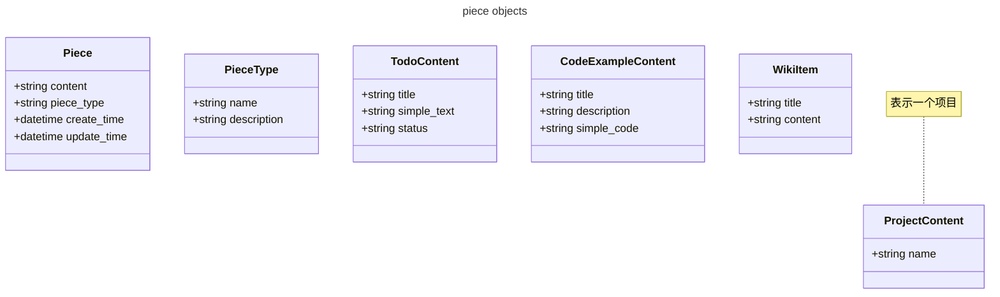
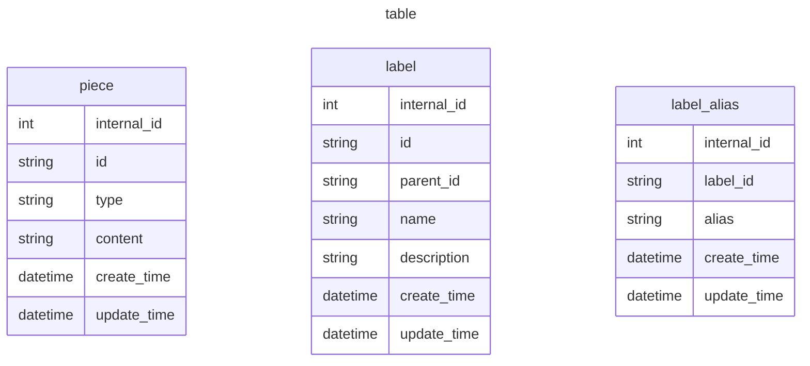

```mermaid
---
title: piece objects
---
classDiagram

class Piece {
    +string content
    +string piece_type
    +datetime create_time
    +datetime update_time
}

class PieceType {
    +string name
    +string description
}

note for ProjectContent "表示一个项目"
class ProjectContent {
    +string name
}

class TodoContent {
    +string title
    +string simple_text
    +string status
}

class CodeExampleContent {
    +string title
    +string description
    +string simple_code
}

class WikiItem {
    +string title
    +string content
}

```

```mermaid
---
title: table
---
erDiagram
piece {
    int internal_id
    string id
    string type
    string content
    datetime create_time
    datetime update_time
}

label {
    int internal_id
    string id
    string parent_id
    string name
    string description
    datetime create_time
    datetime update_time
}

label_alias {
    int internal_id
    string label_id
    string alias
    datetime create_time
    datetime update_time
}
```